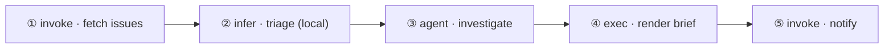
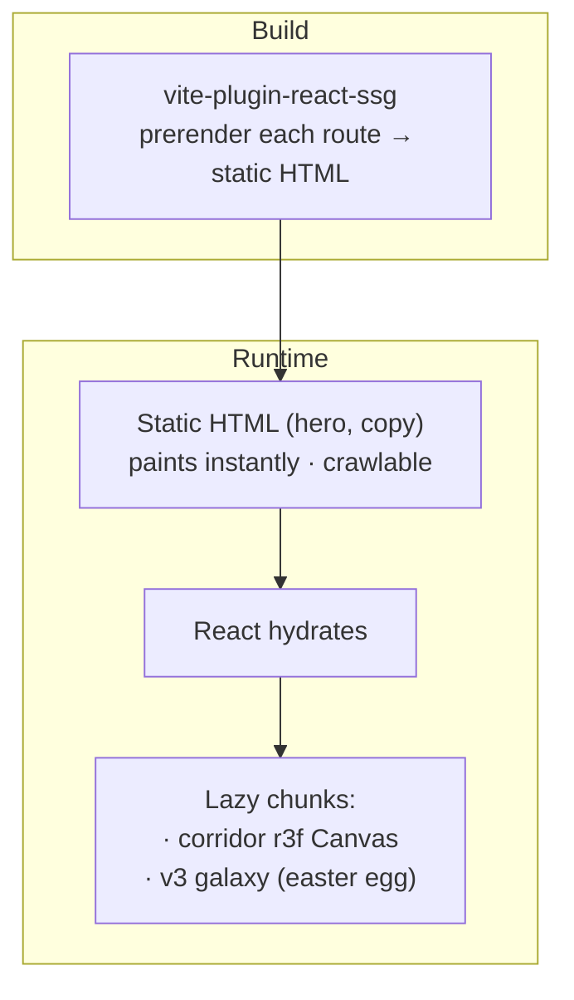

# nika.sh — v4 · Trust Landing redesign (design doc)

> Status: **design / validated direction** · 2026-06-17
> Supersedes the v3 cinematic-galaxy site (preserved — see §10).
> Owner: Thibaut · doc drafted with Olympus.

---

## 1. Why v4

The v3 site is beautiful but **maximalist**: a full-screen galaxy + a 6-layer
post-processing stack run **continuously**, a 5.8s intro film blocks every
visit, and the headline `Intent as Code` is painted **inside WebGL** (a
CanvasTexture) — so it is invisible to crawlers and nothing paints until the
JS bundle + first GL frame are ready.

The result: **wow everywhere, trust nowhere**, and a hero that is neither
instant nor SEO-friendly.

v4 keeps the soul but flips the ratio.

> **The doctrine: _Normal by default, wow on purpose._**
> Calm, credible, content-first like **Cursor / Linear / Raycast**. The wow
> (3D, acid, the film) is preserved but **placed** — at chosen moments, never
> as the ambient. Nothing is deleted; effects are _relocated_.

### Goals
1. **Instant first paint** — hero DOM is prerendered static HTML.
2. **SEO** — real `<h1>` and crawlable copy; real URLs (not hash routes).
3. **Trust** — monochrome, restrained, product-first (show the file working).
4. **Wow, dosed** — one strong effect at a time, reactive, on purpose.
5. **Spec truth** — every YAML shown is valid nika-spec (projected, not typed).

### Non-goals
- Throwing away the cinematic galaxy (it becomes an easter egg — §10).
- A second framework. We stay Vite + React 19 + r3f and **refactor**.

---

## 2. Design principles

| # | Principle | Consequence |
|---|---|---|
| P1 | Normal by default, wow on purpose | 0 post-fx at rest · effects gated per section (§9 EffectBudget) |
| P2 | Black & white always | Color is **rare**: only diegetic (inside the code/graph) or reactive (the aurora). No decorative gradient washes. |
| P3 | Instant + SEO are non-negotiable | Hero = pure DOM, prerendered. WebGL never blocks paint. |
| P4 | Show the product, not adjectives | The hero visual is a real `.nika.yaml` becoming a running DAG. |
| P5 | One strong effect at a time | Aurora **or** acid **or** TV-curve — never stacked. |
| P6 | Spec truth | YAML comes from nika-spec `examples/showcase` via the projector. |
| P7 | The structure is the protection | Effects live behind a declarative budget, not scattered `useFrame`s. |

---

## 3. Palette & motion system (black/white)

### 3.1 Tokens (monochrome)
```
--bg            #0A0B0D   near-black base (Linear/Cursor register)
--bg-raised     #121317   panels, code surfaces
--line          #FFFFFF @ 8%   1px hairline borders
--text          #F4F5F7   primary
--text-dim      #8A8F98   secondary / labels / FIG numbers
--text-faint    #5A606B   captions
--accent        used ONLY in motion moments (the aurora) — not a static color
```
Static site = grayscale. **Color = energy, reserved for the rare wow.**

> **3.1.1 · Same typography as v3 — only color changes.** v4 keeps the existing
> type system verbatim (Martian Grotesk display + Martian Mono + the current
> scale/weights). No new fonts, no resize — the redesign is **color + layout only**.
>
> **3.1.2 · Light AND dark sections (alternation).** "Black & white" means BOTH:
> the page alternates **dark-mode** sections (near-black bg, light ink) and
> **light-mode** sections (warm off-white bg, near-black ink) for rhythm
> (Stripe/Linear register) — it is not all dark. Mechanism: a section opts in with
> `class="theme-dark"` or `class="theme-light"`, which re-scopes the v4 surface/ink
> vars (`src/styles/tokens.css`) so the SAME `bg-bg` / `text-text` / `text-dim` /
> `border-line` utilities flip per section. Typography identical across both; only
> surfaces + ink invert. Light surface `#F7F7F5` · raised `#FFFFFF` · ink `#0A0B0D`;
> dark surface `#0A0B0D` · raised `#121317` · ink `#F4F5F7`. The verb hues + edge
> aurora are the only color, in both modes.

### 3.2 The signature device — reactive edge aurora (the "Siri / Oryzo" halo)
- Center stays **black & readable** (Cursor/Linear). A blurred multicolor
  **halo hugs the screen frame**.
- **At rest (≈99% of the time):** halo almost extinguished, breathing slowly.
- **On events** (a workflow node completes, hover, easter egg): the halo
  **pulses / intensifies** — cyan→violet→cyan.
- It is **the drum** of the manifesto: every run = a beat of the frame.
- Cheap: a CSS/canvas-2D blurred conic-gradient ring — **not** the r3f scene.

### 3.3 Effect budget (where each effect is allowed)
| Effect | Where | Trigger | Cost |
|---|---|---|---|
| Edge aurora | global frame | reactive (run / hover) | cheap (CSS/2D) |
| Acid / fluid warp | 1 section (“Beyond the chat”) | fast scroll, then settles | medium |
| TV-curve / barrel | corridor enter/exit only | scroll transition | low |
| 3D corridor (Living File) | 1 sticky section | scroll-scrub | high, but lazy + paused off-screen |
| Cinematic film (butterfly→supernova) | nowhere by default | **easter egg** (reload / logo click / `nika`) | lazy chunk |

Rule: **no two “strong” effects on screen at once** (P5).

### 3.4 Verbs in black & white
The existing run-sim colors the 4 verbs (infer blue · exec orange · invoke
cyan · agent violet — `src/sections/transform-data.ts`). v4 keeps the **static
site grayscale**; verbs are told apart by **label + a per-verb glyph**, not
color. Inside the **live run only** (the product replica, where color is
diegetic per the Cursor/Linear rule) a **whisper** of the verb hue is allowed —
only on the node/log row while it is `running`, settling to white on `✓`.
Open question (§12 Q5): keep that whisper, or go 100% grayscale + glyph-only.

---

## 4. The hero (DOM-first · instant · SEO)

Pure DOM + CSS. **Zero WebGL.** Paints < 300ms, crawlable.

```
┌─────────────────────────────────────────────────────────────┐ ← aurora subtle
│  ✦ nika   Product ▾   Docs   Spec   Blog   Changelog  ⟮GitHub⟯ │
│                                                       ⟮Install⟯│
│                                                             │
│  FIG 0.0                                                    │  ← blueprint
│  Intent as Code.                                            │     numbering
│  One file. The whole workflow — on your machine, forever.   │     (Linear steal)
│                                                             │
│  ❯ brew install supernovae-st/tap/nika            ⧉ copy    │  ← real install
│  ⟮ ★ Star on GitHub ⟯   Read the spec →                     │     line + 1 CTA
│                                                             │
│   ┌─ morning-brief.nika.yaml ───────────────────┐  ← real   │
│   │ nika: v1                                      │   DOM     │
│   │ workflow: morning-brief                       │   code    │
│   │ model: ollama/qwen2.5                         │   (SEO,   │
│   │ tasks:                                        │    crisp) │
│   │   - id: issues   ▸ invoke                     │           │
│   │   - id: triage   ▸ infer                      │           │
│   │   - id: dig      ▸ agent                      │           │
│   │   - id: report   ▸ exec                       │           │
│   └───────────────────────────────────────────────┘          │
└─────────────────────────────────────────────────────────────┘
   NOIR · 0 post-fx · halo ~off · prerendered HTML
```

- Headline is a real `<h1>` (`Intent as Code.` — permanent per AGENTS.md).
- One emphasized CTA (`Install`); everything else is a flat link (Cursor steal).
- Copy-paste `brew` line with version/OS micro-meta (dev-native trust).
- The code panel is **real DOM text** (syntax-highlighted, monochrome + one
  faint accent on verbs) — it is the same file that comes alive in §5.

---

## 5. The centerpiece — “The Living File”

The literal story of *Intent as Code*: a real file **writes itself**, becomes a
**2D DAG**, then tilts into a **3D depth corridor** and **executes** as you
scroll — all four verbs firing in topological order.

### 5.1 The workflow (spec-valid · all 4 verbs)

> ⚠️ **Illustrative.** Per AGENTS.md, the final file must be authored in
> nika-spec `examples/showcase/*.nika.yaml` and projected via
> `showcase-projector.py` into `usecases-yaml.generated.ts` — never hand-typed
> on the site. `exec`/`agent` field names below to be confirmed against the
> spec before projection.

```yaml
nika: v1
workflow: morning-brief
description: "Triage GitHub issues with a local model, dig with an agent, ship a report"

model: ollama/qwen2.5          # local-first · swap for mistral/mistral-large or any of the 14

vars:
  repo: "supernovae-st/nika"

tasks:
  - id: issues                 # ① invoke — a builtin tool (fetch)
    invoke:
      tool: "nika:fetch"
      args:
        url: "https://api.github.com/repos/${{ vars.repo }}/issues"
        mode: jq
        jq: ".[] | {title, url, comments}"

  - id: triage                 # ② infer — a LOCAL model ranks + summarizes
    depends_on: [issues]
    infer:
      prompt: |
        Rank these open issues by urgency and summarize each ·
        ${{ tasks.issues.output }}
      schema:
        type: object
        required: [ranked]
        properties:
          ranked: { type: array, items: { type: object } }

  - id: dig                    # ③ agent — autonomous investigation loop
    depends_on: [triage]
    agent:
      goal: "Investigate the top 3 issues; find related PRs and likely root cause"
      tools: ["nika:fetch", "nika:grep"]
      max_steps: 8

  - id: report                 # ④ exec — render the brief locally
    depends_on: [dig]
    exec:
      run: "pandoc -o brief.md"
      stdin: ${{ tasks.dig.output }}

  - id: ship                   # ⑤ invoke — notify
    depends_on: [report]
    invoke:
      tool: "nika:notify"
      args: { channel: webhook, message: "Morning brief ready" }

outputs:
  brief: { value: ${{ tasks.report.output }}, type: string }
```

The DAG:


### 5.2 Three phases (scroll = the engine)

**Phase 1 — it writes itself** *(2D · in the hero · instant)*
The file types once (one subtle motion), then rests. Real DOM. Aurora ~off.

**Phase 2 — the file becomes a graph** *(2D · the “aha”)*
```
  morning-brief.nika.yaml
  ┌──────────────┐
  │ issues ∙∙∙∙∙∙∙┼┐    each task line DETACHES from the file …
  │ triage ∙∙∙∙∙∙∙┼┼┐        … and lands as a node
  │ dig    ∙∙∙∙∙∙∙┼┼┼┐
  │ report ∙∙∙∙∙∙∙┼┼┼┼┐
  │ ship   ∙∙∙∙∙∙∙┼┼┼┼┼┐
  └──────────────┘│││││
   (issues)─▶(triage)─▶(dig)─▶(report)─▶(ship)   ← flat 2D graph, clean
```

**Phase 3 — it runs, in depth** *(3D · grid corridor · scroll-scrub)*
The flat graph lies down toward a horizon; a **perspective grid** gives volume;
the **camera flies forward as you scroll**. Each node crossing the **focal
plane** lights its verb, emits its output, and the **aurora beats**.
```
              vanishing point ✦  ── horizon ──
          ╲ · · · · · · · · · · · · · · · · · ╱
           ╲   (ship)              (report)    ╱     FAR = not yet run
            ╲       ╲               ╱         ╱       (small, dim)
             ╲    (report) ◀──────(dig)      ╱
   ░░░░░░░░░░░╲░░░░░░░░░░░░░░░░░░░░░░░░░░░░░╱░░░░  ◀ FOCAL PLANE
              ╲      ▸ (dig) ◀  agent…     ╱        the verb LIGHTS here
   ───────────●───────────┼───────────────●──────  horizon grid
  ═════════════╲══════════┴══════════════╱═══════
 ▔▔▔▔▔▔▔▔▔▔▔▔▔▔▔ floor grid receding ▔▔▔▔▔▔▔▔▔▔▔▔   NEAR = already run
       (triage) ✓                                   (large, bright)
  ┌─ output ───────────────┐
  │ ✓ 14 issues · 3 hot      │   ▼ scroll = travel forward through the run
  └──────────────────────────┘
```
- **2D** = the file + node labels (real DOM, crisp, SEO, no drei `<Text>`).
- **3D** = the corridor, the grid, the forward camera, the aurora.
- **Comprehension** = file → graph → run → a **concrete result** (`brief.md`).

### 5.3 How it’s built (grounded)
- The corridor is **one tall sticky section** (~300vh). Its internal animation
  is driven by the section’s own scroll progress (computed from
  `getBoundingClientRect`), fed into `useFrame`. We do **not** use drei
  `<ScrollControls>` for the whole page (it hijacks document scroll and breaks
  the prerendered, normally-scrolling marketing page).
- The per-node activation uses the **drei `useScroll` math pattern**
  (`range(start, dist)` to light each verb, `curve()` for the focal “bloom”)
  applied to our own progress value.
- The r3f `<Canvas>` is **lazy-mounted** (`React.lazy`) and only when the
  section nears the viewport; `frameloop` is paused (IntersectionObserver) when
  off-screen → **0 GPU work at rest** (P1).
- Node labels = DOM overlay (absolutely positioned, synced to projected node
  positions) — keeps text crisp + crawlable + dodges the no-`<Text>` rule.
- Headless verify with swiftshader Chromium (`?it=N` style freeze), per AGENTS.md.

### 5.4 Execution observability — the REAL formats (SOTA "watch it run")

During the run, the screen shows **two synchronized surfaces** (the GitHub
Actions / Vercel / Temporal pattern): the **3D corridor** (spatial) + a **live
event stream** (textual). The stream toggles **pretty CLI ↔ raw NDJSON** — the
detail that proves it's a real engine. All formats below are taken from the
real spec/docs, not invented.

**(a) Pretty CLI** — the one canonical `nika run` example (docs
`getting-started/first-workflow.mdx`). Glyphs: `▶` running · `✓` done · `·`
sub-event · `T+mm:ss.ms` elapsed:
```
▶ issues  invoke  → nika:fetch
✓ issues  T+00:00.21   14 items
▶ triage  infer   → ollama/qwen2.5
  · infer.delta ··········   (streaming tokens)
✓ triage  T+00:01.07   { ranked: 14 }
▶ dig     agent   · turn 3/8 · invoke.result nika:grep ✓
✓ dig     T+00:02.6
▶ report  exec    → pandoc
✓ report  T+00:03.4    brief.md
── outputs (stdout) ─────────────────
{ "brief": "./brief.md", "hot": 3 }            exit 0
```

**(b) NDJSON event stream** (`nika run --events ndjson`). Real `Event` shape:
`{ id(ULID), run_id(ULID), trace_id?, kind, timestamp_ms, payload }`. Real
kinds: `workflow.started|completed|skipped` · `task.started|completed|failed|
skipped|cancelled|retry` · `infer.delta|usage|done` · `exec.output` ·
`fetch.request` · `invoke.result` · `checkpoint` · `budget.warning`:
```
{"kind":"workflow.started","run_id":"01J8KQ…","timestamp_ms":1718…}
{"kind":"task.started","task_id":"issues","payload":{"verb":"invoke"}}
{"kind":"invoke.result","task_id":"issues","payload":{"items":14}}
{"kind":"task.completed","task_id":"issues","payload":{"duration_ms":210}}
{"kind":"infer.delta","task_id":"triage","payload":{"text":"1. …"}}
{"kind":"infer.usage","task_id":"triage","payload":{"tokens":842}}
{"kind":"task.completed","task_id":"triage","payload":{"duration_ms":1070}}
{"kind":"workflow.completed","payload":{"status":"success","exit":0}}
```

**(c) Task state model** (authentic, closed enum): `success | failure |
skipped | cancelled` + implicit `pending` / `running`. Per-task fields rendered:
`.status · .output · .started_at · .ended_at · .duration_ms · .error`.

**(d) The failure path** (reuse the existing RunSim "chaos mode"). Typed error
`{ code, category, message, transient, details, task_id, attempt }` across 14
`NIKA-XXX` namespaces — data already in-repo at `public/errors/catalog.json`:
```
✗ report  NIKA-EXEC-001  non-zero exit (127)   transient:false
⊘ ship    cancelled · default gate needs report green
── error (stderr) ──                            exit 1
```

**(e) The boundary contract** (spec `01-envelope.md`): the `outputs:` object is
a single JSON object on **stdout**; logs/progress/events on **stderr**, never
interleaved; exit code maps 1:1 (success→0, failure/cancelled→non-zero).

> **Color note:** the verb-color whisper (§3.3) maps to these lines — a node /
> log row tints its verb hue only while `running`, then settles to white on `✓`.

### 5.5 We are NOT starting from scratch (reuse the existing run-sim)

The site already ships the bones — v4 promotes + calms + B&W-ifies them and
adds the NDJSON/CLI dual stream + the 3D depth corridor:
- `ShowcaseTask` / `ShowcaseDag` (`src/sections/usecases-yaml.generated.ts`) —
  `{ id, verb, deps, wave, gate, gloss, flags, line0, line1 }` per node + `waves`.
- `RunSim.tsx` — wave-based topological execution animation **+ a chaos mode**
  that already simulates a mid-run failure with gate propagation.
- The log-line render pattern in `Transform.tsx` (verb-bullet · text · `✓`).
- 27 real spec workflows in `SHOWCASE_YAML`; the 4-verb palette in
  `src/sections/transform-data.ts`.

---

## 6. Home — section list (steals from Cursor/Linear/Raycast)

One idea per section · alternating copy + a product replica · generous
whitespace · a **FIG / blueprint numbering** scheme (Linear steal — perfect fit
for “Intent as Code”).

```
FIG 0.0  Hero — the file (calm, instant)                    → trust
FIG 1.0  The Living File — write → DAG → 3D run (sticky)     → THE wow, dosed
FIG 2.0  The four verbs — infer · exec · invoke · agent      → clarity (2×2 grid)
FIG 3.0  Beyond the chat — file vs chat / API / platform     → the acid moment
FIG 4.0  Own your workflows — local-first · 14 providers · AGPL  → sovereignty
FIG 5.0  Toolbelt — 23 builtins · 14 providers · MCP (live counts) → trust by numbers
FIG 6.0  Use cases — real showcase workflows (tabbed, from spec) → proof
FIG 7.0  Changelog — 3–4 dated entries (Cursor/Linear steal) → “alive / shipping”
FIG 8.0  Proof — named quotes + ONE big number               → authority, placed late
FIG 9.0  Final CTA + SUPERNOVAE footer (KEPT, intact)        → close
```
- Counts in FIG 5.0 come from `CANON` in `src/canon.generated.ts` (23 builtins,
  14 providers = 8 cloud led by **Mistral**, 5 local, 1 mock) — never hand-typed.
- Provider presentation order: **local/open-weight first**, then Mistral, then
  the rest (per the studio’s example-order convention).
- Proof (FIG 8.0) is **late**, not in the hero — product opens the page.

---

## 7. Information architecture (nav + pages)

**Nav** — sticky, sober, **one** emphasized CTA (`Install`); everything else a
flat link. Two grouped mega-menus (Linear register), not flat dropdowns:
```
✦ nika    Product ▾    Docs    Spec    Blog    Changelog       GitHub ↗   ⟮ Install ⟯

  Product ▾  (grouped panel · 3 columns)
    LANGUAGE            WORKFLOWS           LEARN
    · Verbs            · Use cases         · Quickstart (5 min)
    · Builtins (23)    · Playground        · Manifesto
    · Schema           · Showcase          · Blog
```
- Scrolls from transparent-over-hero → solid hairline-bordered on scroll.
- `Install` opens a small popover: `brew` line + `curl | sh` + GitHub releases.
- Mobile: collapses to a sheet; the mega-menu becomes an accordion.

**Routes** — migrate hash (`#/x`) → **real paths** (`/x`). Each route is
prerendered to its own `index.html` with per-page `<head>` (Unhead) for SEO:

| Route | State | What it is · how it's presented |
|---|---|---|
| `/` | rebuild | the v4 landing (§4–§6) |
| `/docs` | keep | Mintlify — external, untouched |
| `/spec` | **NEW** | language reference: `nika: v1`, the 4 verbs, 23 builtins, 14 providers, the JSON schema + the 14 `NIKA-XXX` error namespaces. Built from in-repo `public/schema/workflow.json` + `public/errors/catalog.json`. FIG-numbered, monochrome, Linear-`Method` register. |
| `/changelog` | **NEW** | dated ship log with version tags, monochrome. Home shows the latest 3–4 (FIG 7.0); the page shows all. Projected from engine release notes where possible. |
| `/use-cases` | **NEW** | gallery of the 27 `SHOWCASE_YAML` workflows; each card opens a mini Living-File run (reuses `RunSim`). |
| `/blog` | keep | exists |
| `/learn` | keep | 5-min quickstart (exists) |
| `/play` | keep | playground (exists) |
| `/manifesto` | keep | the drum (exists) — untouched |

**Shared shell** (`src/shell/`): `<Nav>`, `<Footer>` (the SUPERNOVAE wordmark —
**kept intact**), and the global `<EdgeAurora>` (§3.2) wrap every route.

---

## 8. Technical architecture



- **Prerender:** `vite-plugin-react-ssg` (`reactSsg()` in `vite.config.ts`,
  `react-ssg.config.ts` lists routes). Build-time only; hydrates client-side
  via `window.__staticRouterHydrationData`. Per-page meta via `@unhead/react`.
- **Routing:** React Router data router (path routes) — replaces hash routing.
- **Hero:** 0 WebGL. Edge aurora = CSS/canvas-2D.
- **3D:** single lazy Canvas for the corridor; `frameloop` paused off-screen;
  DPR-capped + a coarse perf tier (see §11).
- **DigitalOcean:** static `dist/`, per-route `index.html` (SSG handles SPA
  fallback). Gates unchanged: `pnpm check && pnpm lint && pnpm build`, 0 warns.

### 8.1 The EffectBudget (the “scene manager” — answers “gérer les effets”)
A single declarative source of truth instead of scattered effects:
```ts
// one place decides what runs where
const SECTION_FX = {
  hero:      { webgl: false, aurora: 'idle' },
  living:    { webgl: true,  aurora: 'reactive', curve: true },
  beyond:    { webgl: false, aurora: 'idle', acid: true },
  // …
} as const
```
Gated globally by: `prefers-reduced-motion`, perf tier, and route. No effect
mounts unless its section is active. This is the structural fix for v3’s
“everything on, everywhere, always.”

---

## 9. Motion inventory (what moves, and when)

| Moment | Effect | Default state |
|---|---|---|
| Any run / hover | aurora pulse | idle 99% |
| Living File | 3D corridor + scroll-scrub | mounts near-viewport only |
| Beyond the chat | acid warp on fast scroll | settles to still |
| Corridor enter/exit | TV-curve transition | off otherwise |
| Reload / logo / type `nika` | **v3 cinematic** (butterfly→supernova→galaxy) | easter egg only |

---

## 10. v3 → v4 migration (set the old one aside, lose nothing)

1. **Tag the current site** `site-v3-cinematic` (git is the archive).
2. **Branch** `v4-trust-landing`; `main` stays v3 until v4 ships (auto-deploy
   is on `main` → DigitalOcean, so v4 matures on the branch).
3. **The v3 galaxy becomes the easter egg.** The whole cinematic scene
   (`src/scene/*`) is kept, lazy-loaded, and triggered by reload / logo-click /
   typing `nika` → “enter the galaxy.” The old wow becomes the hidden delight.
4. **Refactor** the home into composable sections behind the EffectBudget;
   move shared bits (nav, footer — **footer kept intact**) into `src/shell/`.

---

## 11. Risks & non-negotiables
- **Spec truth (AGENTS.md):** all YAML projected from nika-spec, never typed.
  Action: add `morning-brief` to `examples/showcase` + project.
- **Live URLs are contracts:** keep `public/install.sh`, `llms.txt`,
  `schema/workflow.json`, `errors/catalog.json`, `404.html`.
- **No private content** (public repo): design only, no strategy/brand.
- **Reduced motion:** every effect has a static fallback (already partly wired).
- **Perf tiers / mobile:** coarse WebGL capability check → corridor degrades to
  a clean 2D SVG DAG on low-end / touch; DPR capped.
- **No drei `<Text>`** in scene; headless swiftshader verify retained.
- **Commit trailer:** `Co-Authored-By: Nika 🦋 <nika@supernovae.studio>`.

---

## 12. Open questions
1. `/spec` — bespoke page on nika.sh, or redirect into Mintlify docs?
2. `/changelog` — hand-authored MDX, or projected from engine release notes?
3. Proof (FIG 8.0) — do we have quotable users yet, or lead with the big number
   (GitHub stars / providers / builtins) until quotes exist?
4. Corridor low-end fallback — full 2D SVG DAG, or a static poster image?
5. Verbs in the live run — strict grayscale (glyph-only), or a whisper of the
   4 verb-colors on the active node only (diegetic)?

## 13. Next step
Turn this into an implementation plan (`writing-plans`): phase the refactor
(routing+SSG → shell/nav/footer → hero → Living File corridor → sections →
new pages → v3 easter egg), each phase shippable behind the branch.
